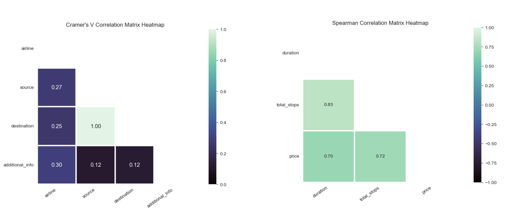
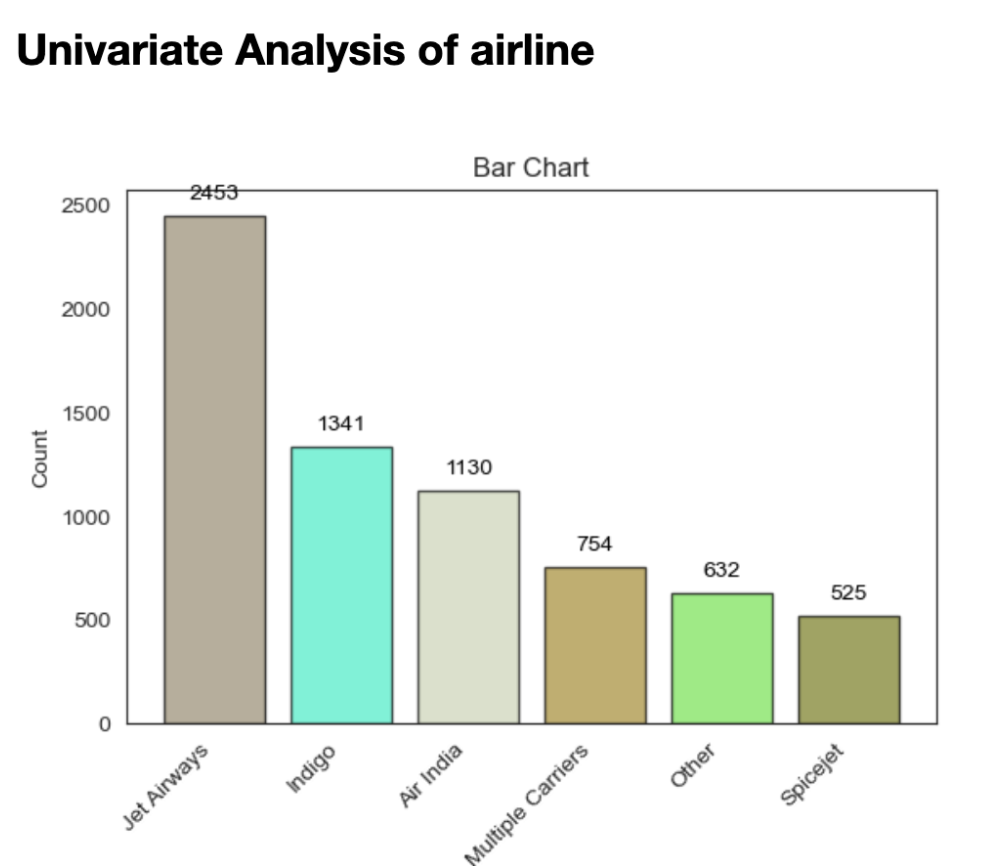
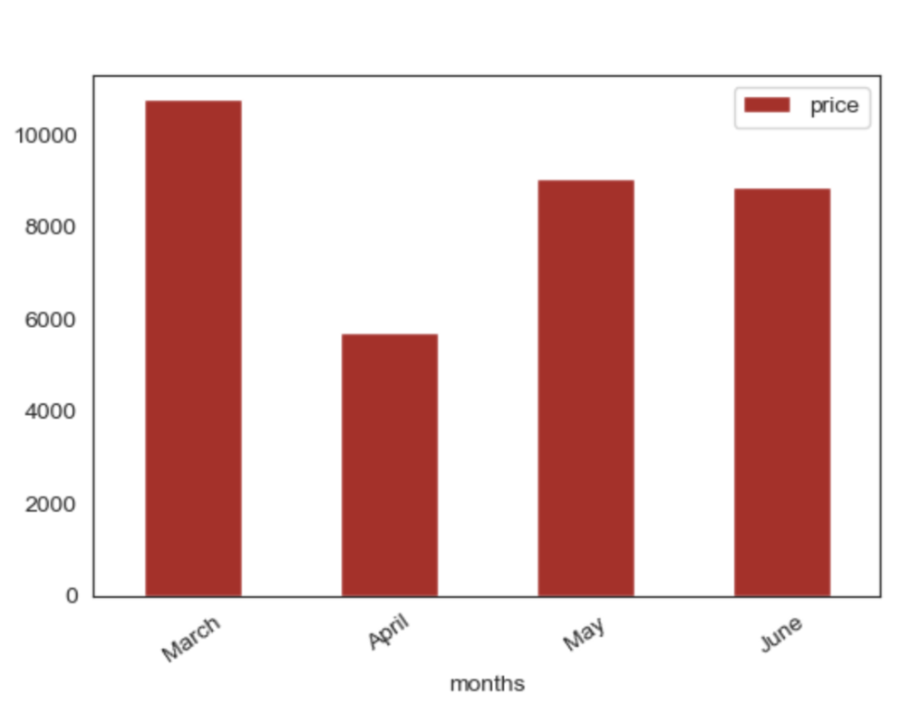
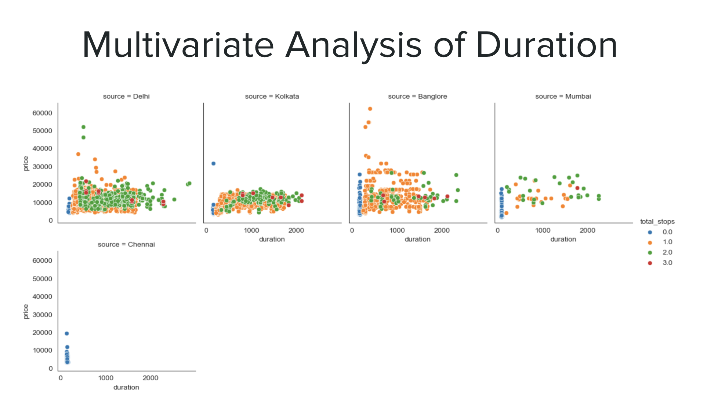

# Flight Prices Prediction: A Regression Project using AWS Sagemaker

This is a regression model for predicting flight prices based on various attributes.

#### Link: [Flight Price Prediction](https://flight-prices-prediction-sagemaker.streamlit.app/)

## Problem Statement

Air travel is a vital part of the global economy, but flight prices can be opaque and fluctuate significantly. Understanding the factors that influence flight prices can empower travelers to make informed decisions and potentially save money.

This dataset of flights, containing details like airline, route, duration, and stopovers, presents a valuable opportunity to analyze these factors and build a model for predicting flight prices.

### Purpose of Analysis:

This analysis aims to develop a machine learning regression model that accurately predicts flight prices based on the available data points. This model can benefit various stakeholders:

**Travelers**: By understanding the key drivers of flight prices, travelers can make informed decisions about airlines, routes, and travel times to find the most cost-effective options.

**Travel Agencies & Booking Platforms**: The model can guide travel agencies and booking platforms in recommending flights that match customer budgets and preferences.  

**Airlines**: Insights from the model can help airlines optimize pricing strategies to maximize revenue while remaining competitive.   

## Executive Summary

### Data Cleaning Steps

1. **Handling Missing Values:** Dropped incomplete data rows.
2. **Removing White Spaces:** Stripped white spaces from string columns.
3. **Lowercasing Column Names:** Converted column names to lowercase for consistency.
4. **Transforming Airline Names:**
   - Simplified airline names by removing additional descriptors.
   - Standardized 'Goair' to 'Go Air' and capitalized airline names.
5. **Converting Date and Time Columns:**
   - Converted 'Date_of_Journey' column to datetime format.
   - Formatted 'dep_time' and 'arrival_time' columns to datetime.
6. **Converting Duration to Minutes:**
   - Applied regex to transform Duration column
   - Converted 'duration' column to minutes.
8. **Converting Total Stops:**
   - Converted 'total_stops' to numeric format after standardizing values.
9. **Dropping Redundant Columns:** Removed 'route' column.
10. **Split:** Split data into three different datsets. train, test, validate.

These steps ensure data consistency and prepare it for analysis and modeling.

### Key Visualizations

#### Visualization 1: Correlations.
Cramer's V correlation for Categorical-Categorical Variables.
Spearman's correlation for numerical-numerical variables.

#### Visualization 2: Airlines

#### Visualization 3: Mean price by month

#### Visualization 4: Multivariate Analysis 

## Feature Engineering & Selection
After Performing Feature Engineering, there were total 31 features. I used **RandomForestRegressor** for feature selection. Based on **r2** score dataset got 12 most strongly associated features with target variables **Price**

## Model Training and Deployment

- **Model Training and Tuning:** AWS SageMaker was utilized for training and tuning the model, leveraging its scalable infrastructure and machine learning capabilities.

- **Data Storage:** AWS S3 was employed to store the dataset used for training the model, providing reliable and scalable object storage.

- **Web App Deployment:** The trained model is deployed using Streamlit Cloud, enabling easy-to-use web-based interfaces for users to interact with the model predictions.

- **Version Control:** GitHub is utilized for version control and collaboration, facilitating seamless management of the project codebase and resources.

## Results    
**Web App Link:** [https://flight-prices-prediction-sagemaker.streamlit.app/]

---
